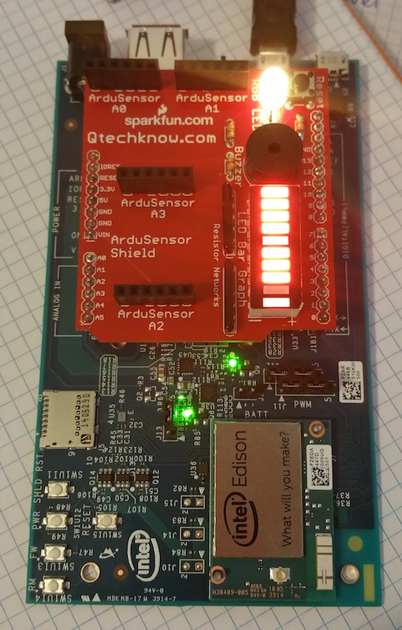
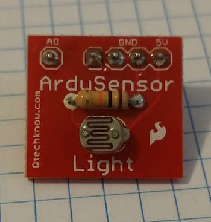
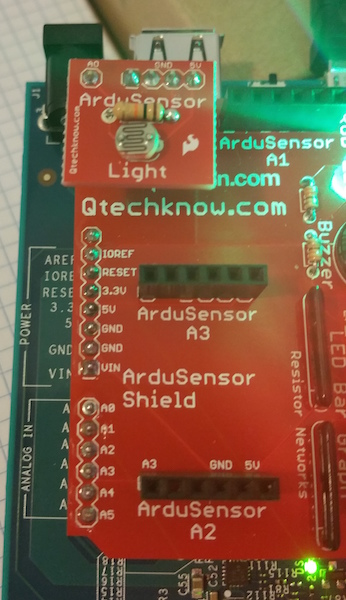
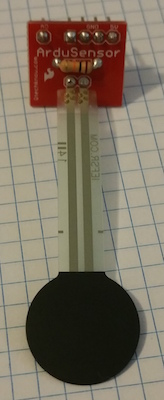
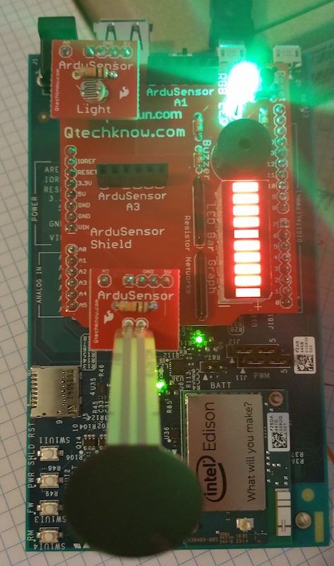
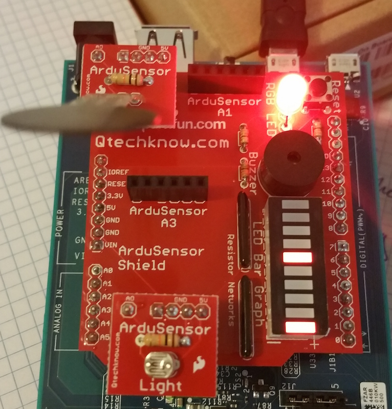

#Learning About Sensors
You've probably heard about the Internet of Things, or IoT. In a nutshell, IoT describes all sorts of "things" networked and connected via the internet. Lots of these "things" have, or are, sensors. This could be something like a motion detector that turns on a networked security camera, or a soil moisture sensor that sends readings to a server that controls an irrigation system, or a temperature sensor that sends out an alert when a freezer breaks and warms up.

This activity will show you some basics about sensors using an Arduino board and a couple of sensors with LED outputs. And at the end, you'll have a chance to win a prize!

##What are we playing with here?
What we have at this station is an Intel Edison using an Arduino breakout board. If you did the Programming 101 activity, you know about Arduino - it's an open-source hardware project that's used by lots of makers for their projects. One of the great things about Arduino is that there is tons of compatible hardware that can work with it. What we have on top of the Edison is an Arduino shield -- an add-on board that brings new functions. This shield is called an "ArduSensor", and it's designed to make working with sensors easy.

##How does it work?
The ArduSensor has 4 spots to connect sensors. These are the black headers on the board, labeled ArduSensor A0-A3. It also has an RGB LED, a buzzer, and an LED bar graph display, which you can use to visualize (or hear) the sensor readings. In this activity, we'll use two sensors:
- a light sensor, that detects the amount of light
- a force sensor, which is a touch sensor that detects the force of a touch

##You try it!
There should be a program running on the Edison and ArduSensor already, but go ahead and hit the Reset button in the upper right corner of the ArduSensor, and gently pull out any sensors that are attached to it. It should look like this:

Now, find the sensor block that says "light". It looks like this:

Go ahead and gently plug it in to the ArduSensor A0 slot in the upper left. Make sure the pins line up and it's oriented correctly, like this:

Move your hand back and forth over the light sensor. What happens? The LED should change colors as you move it! This means the light sensor is detecting the change in light levels, and they're being shown by the color generated by the LED.

Next, find the force sensor, it looks like this:

Gently plug it into the ArduSensor A2 slot at the bottom of the board. Again, make sure the pins line up and it's correctly oriented, like this:

Now, softly pinch the round disc of the force sensor between your thumb and forefinger. What happens? The bar graph reading should go to 0. See if you can gently vary the force of your pinch, and the bar graph should move up and down! The sensor is detecting the changes in your force, and showing them on the graph.

Now swap the two sensors: put the force sensor in A0 and the light sensor in A2, like this:

Go ahead and hit the reset button in the upper right. Now, like you did before, gently squeeze the force sensor, and move your hand over the light sensor. What happens? The LED should change color when you squeeze the force sensor and the bar graph should move as your hand affects the light level.

That's it -- you've created a sensor and display unit!

##Want to win a great prize?

The default color of the RGB LED when the force sensor is plugged into A0 is red (hit the reset button and the light will go red). After you complete the above steps, hit that reset button, then give the force sensor a gentle squeeze to change the LED color. Once you've got it a different color, do this to win:
- Take a photo with the LED lit up, or even better, get a friend to snap a photo of you with the light, and post it to Twitter or Instagram using the hashtags #idf15 and #intelmaker.
- We'll be selecting a winner each day, and will notify you via the social media channel you posted to. Keep an eye out, you'll need to come back and claim your prize!
- We'll randomly choose winners from all the photos each day.
- Intel employees are not eligible for prizes.  One prize per IDF attendee. 
