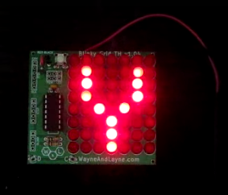

#Light and Vision - Blinky Grid
Skill level: Beginner

Another fun feature of many maker projects are LEDs - light emitting diodes. LEDs come in different sizes, and many different configurations. In this activity -- and its sister activity with the Blinky POV -- we'll learn to program some LED arrays to display some simple graphics and messages.

##What are we playing with here?

We're going to use a Blinky Grid, which is an 8x7 matrix LEDs controlled by an onboard chip.

##You try it!

The great thing about the Blinky Grid is that it also has a couple of on-board light sensors that make it easy for you to program your own messages and graphics. To program the Blinky Grid:
- Go to http://www.wayneandlayne.com/blinky_programmer/ (We suggest you open this in a new tab so you can refer back here for help)
- Type in the message, or create the pixel graphic, you want to show in the box
- Scroll down a little bit to the Programming section
- Take a look at the Blinky Grid, and you'll see a couple of light sensors on it (they look like clear LEDs). They're marked "C" and "D", which stands for Clock and Data. Note which side of the BlinkyPOV is which
- Follow the instructions below to turn on the BlinkyPOV and to put it into programming mode. When you get to step 4 ("Hold the sensors up to the screen"), hold the board as shown in the image below, with the "C" light sensor over the Clock block and the "D" light sensor over the Data block.

##Want to win a great prize?
Program your message or graphic into the Blinky Grid, then do this to have a chance at a prize:
- Take a photo with the matrix lit up, or even better, get a friend to snap a photo of you with the it, and post it to Twitter or Instagram using the hashtags #idf15 and #intelmaker.
- We'll be selecting a winner each day, and will notify you via the social media channel you posted to. Keep an eye out, you'll need to come back and claim your prize!
- We'll randomly choose winners from all the photos each day.
- Intel employees are not eligible for prizes.  One prize per IDF attendee. 
