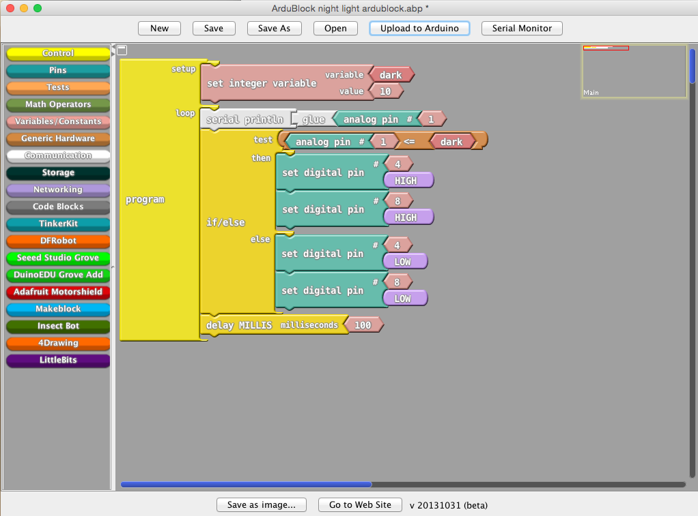

#Station 2: For Beginners - Programming 101

You'll have to learn a little bit of programming at some point for your maker projects! But even if you are completely new to coding, we will show you a way to get started using some easy drag-and-drop tools, and a piece of hardware called a Digital Sandbox.

##What's a Digital Sandbox?
The Digital Sandbox is a board with a microcontroller and several integrated sensors (such as temperature and light sensors), and input and output devices (like buttons and LEDs). It can be easily programmed because it's also an Arduino board. You might have heard of Arduino - it's an open-source hardware project that's used by lots of makers for their projects. The Intel Galileo and Intel Edison boards are also Arduino-compatible.

##How's it work?
Arduinos run programs called Sketches that control how they operate, and how they interact with all the other pieces of electronics, like sensors and lights, that are attached to them. Sketches are normally written in a computing language that's based on C/C++; we're going to use something called ArduBlock that provides a visual, drag-and-drop interface that's a bit simpler, and then it spits out a Sketch the Arduino (in this case, the Digital Sandbox) can understand.

##You try it!
On the desktop of this computer, there should be a file called "night light ardublock.abp". Double-click it and you should get something that looks like this:

On the left side, you'll see a number of things like Control, Pins and Tests. These are elements you can click and bring into your program. On the right side, you'll see a number of these elements combined into a program. This particular program is an automatic nightlight! When the reading from the light sensor on the Digital Sandbox (marked A1 on the board, top middle) falls below a certain level, the board will turn on the white LEDs marked D4 and D8 (lower left of the board).

A few things make this happen:
- In the "set integer value" block at the top, we name a variable called "dark" -- this is the level at which we've determined the room is dark -- and set it to 10 (out of 1023, which is the maximum brightest value).
- There's a large "if/else" block, which tests the value from the light sensor, then tells the board how to respond.
- The light meter is attached to analog pin 1 (hence A1), so you'll see the line that says "test" taking the value from that pin, and seeing if it's less than or equal to our "dark" level.
- If the reading is 10 or less, the board will follow the instructions in the "then" blocks - turn on the LEDs on digital pins 4 and 8 by setting them to high.
- If the reading is higher than 10, it will follow the "else" instructions - turn the pins to low (which is off).
- The delay and loop you see tells the board to briefly wait, then start the process over.

Try it! Push the "Upload to Arduino" button, and the sketch will load to the Digital Sandbox. Once the Arduino IDE says "Done Uploading," your nightlight should work. Test it by putting your hand over the light sensor -- the two white LEDs should come on!

##Want to win a great prize?
Now you're ready for the next-level challenge, and the chance to win a great prize like an Android tablet. Here's what you do:

White LEDs are great, but colored ones are much cooler. Let's make your nightlight show some color instead! To do this, we need to tell the board not to turn on the white LEDs, but the colored ones instead. Think back to the explanation above: that if/else block tells the board to set digital pins 4 and 8 to high (turning them on) when it's dark, and set them to low when it's light.

If the green LED is on digital pin 10 and the red LED is on digital pin 9, how do we get them to come on? You've got it - change the set digital pin variables to the correct pins. Do this, then once again hit "Upload to Arduino".

Once it's done, try covering the light sensor again. What happened? Did you get a yellow light? That's because the RGB LED mixed red and green, like you told it to! Did your light turn off again? If yes, great! If no, you didn't change the digital pin settings in the "else" statement too. Go back and change them, re-upload and see if it works.

Once you get that yellow light going on and off, do this to have a chance at a prize:
- Take a photo with the yellow light on, or even better, get a friend to snap a photo of you with the light, and post it to Twitter or Instagram using the hashtags #idf15 and #intelmaker.
- We'll be selecting a winner each day, and will notify you via the social media channel you posted to. Keep an eye out, you'll need to come back and claim your prize!
- We'll randomly choose winners from all the photos each day.
- Intel employees are not eligible for prizes.  One prize per IDF attendee. 
